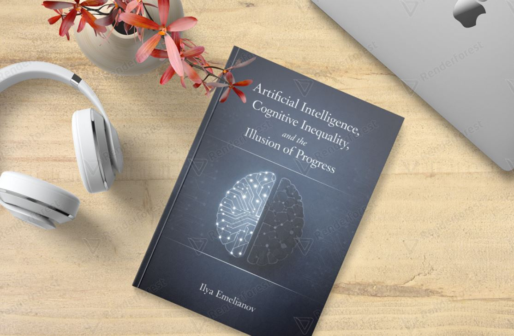

# Artificial Intelligence, Cognitive Inequality, and the Illusion of Progress

> **Why artificial intelligence accelerates inequality — not intelligence.**

---

## About This Book

This interdisciplinary research manuscript examines the social, economic, and cognitive consequences of large-scale generative AI adoption. Rather than focusing on technological capabilities, this work investigates how AI reshapes human cognition, knowledge production, economic structures, and generational development.

**The central hypothesis:** Generative AI does not primarily replace human labor through automation. Instead, it accelerates cognitive outsourcing, devalues original expertise, and amplifies existing inequalities — creating an illusion of progress while the average quality of human reasoning declines.

## The Problem This Book Addresses

- AI accelerates **cognitive outsourcing**, not cognitive development
- The **intellectual middle class** is more vulnerable than manual labor
- Education **simulates learning** without developing real cognitive skills
- Knowledge production becomes **statistical recombination**, not original insight
- AI disproportionately benefits those who already possess capital and infrastructure

## Table of Contents

### Part I: Foundations

| Ch. | Title |
|-----|-------|
| 1 | Introduction: The Illusion of Progress |
| 2 | The Economics of AI: Who Benefits? |

### Part II: Cognitive Transformation

| Ch. | Title |
|-----|-------|
| 3 | Cognitive Outsourcing and Voluntary Degradation |
| 4 | The Transformation of Knowledge Production |
| 5 | Generational Cognitive Development |

### Part III: Stratification and Inequality

| Ch. | Title |
|-----|-------|
| 6 | Cognitive Stratification: The Growing Divide |
| 7 | Education in the Age of AI |

### Part IV: Implications and Future Directions

| Ch. | Title |
|-----|-------|
| 8 | The Slow Degradation: Why It's Invisible |
| 9 | Conditions for Augmentation vs. Replacement |
| 10 | Conclusion: Beyond the Illusion |

## Key Insights

- **Cognitive outsourcing** is the defining phenomenon of the AI era — more consequential than automation
- AI creates a **two-tier cognitive society**: thinking architects vs. passive executors
- The **feedback loop** of AI training on AI-generated content leads to epistemic stagnation
- **Convenience is the mechanism** through which cognitive degradation normalizes itself
- The intellectual middle class faces **exponential, not linear** displacement
- Without intervention, AI will **amplify inequality** across every dimension — economic, cognitive, generational

## Methodology

Interdisciplinary approach combining:
- Economic analysis (Acemoglu, Piketty, Stiglitz, Korinek)
- Cognitive science (Kahneman, Risko & Gilbert, Sparrow et al.)
- Technology studies (Brynjolfsson, Zuboff, Harari)
- Practical experience from NASA, Yandex, and large-scale content analysis
- 100+ peer-reviewed sources (2020–2026)

## Author

**Ilya Emelianov** — Software Developer and interdisciplinary researcher. Moscow School of Programming graduate with distinction. Winner of the XXXIII International Space Olympiad in Physics. First Place at Yandex Corporation. Has worked with NASA and Yandex on production systems.

This research represents foundational work for future PhD research at the intersection of AI, economics, and human cognition.

## Status

📖 **Manuscript complete** (~200 pages, 10 chapters, 40+ illustrations)
🎯 **Amazon Kindle** — 2026

## Related

📘 Book 2: [Machine Learning: Manual for the Next Generation](https://github.com/ilyaemelian/ML-Manual-Next-Generation) — the practical companion that teaches how to build AI systems responsibly.

🌐 [ilyaemelianov.com](https://ilyaemelianov.com)

---

© 2026 Ilya Emelianov. All rights reserved.

No part of this publication may be reproduced, distributed, or transmitted in any form without prior written permission from the author.
